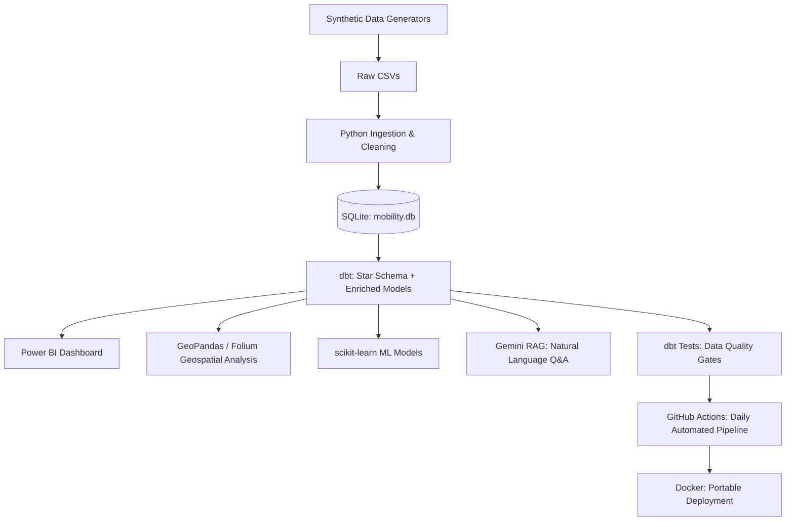

# Architecture

## Layer descriptions

- **Ingestion:** Python scripts generate/clean raw trip and traffic data, loading it into SQLite.
- **Modeling:** dbt builds a star schema (4 dimensions, 2 facts) and two enriched, analysis-ready views, with automated tests.
- **Consumption:** the enriched models feed four independent consumers — Power BI, geospatial scripts, ML models, and the RAG system — each reading the same trusted source of truth.
- **Operations:** GitHub Actions runs the entire pipeline and test suite daily; Docker packages everything for portable, reproducible execution anywhere.