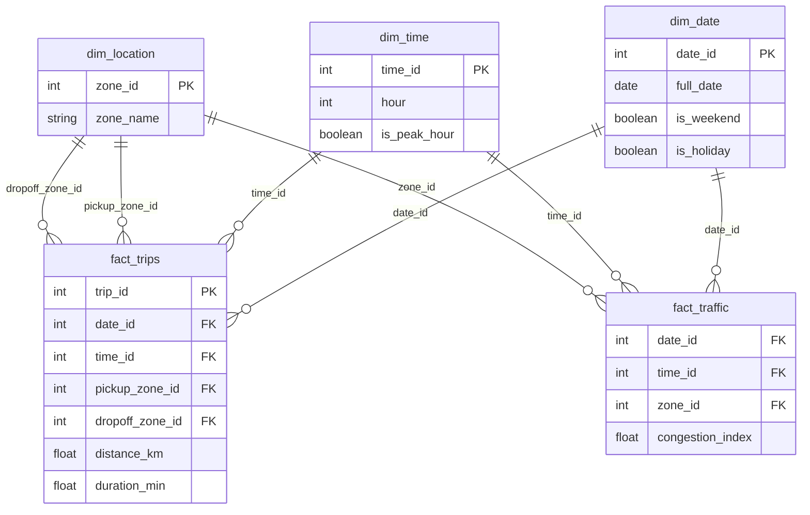

# Database Schema

## Entity-Relationship Diagram

## Design notes
This is a **star schema**: two fact tables (`fact_trips`, `fact_traffic`) each connect to shared dimension tables (`dim_date`, `dim_time`, `dim_location`). `fact_trips` joins `dim_location` **twice** — once for pickup zone, once for dropoff zone — since a single trip references two different locations. `dim_weather` (not shown above) joins to both fact tables via `date_id`.

See `data_dictionary.md` for full column-level detail on every table.